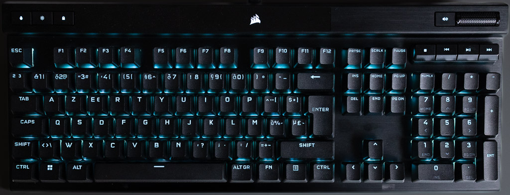
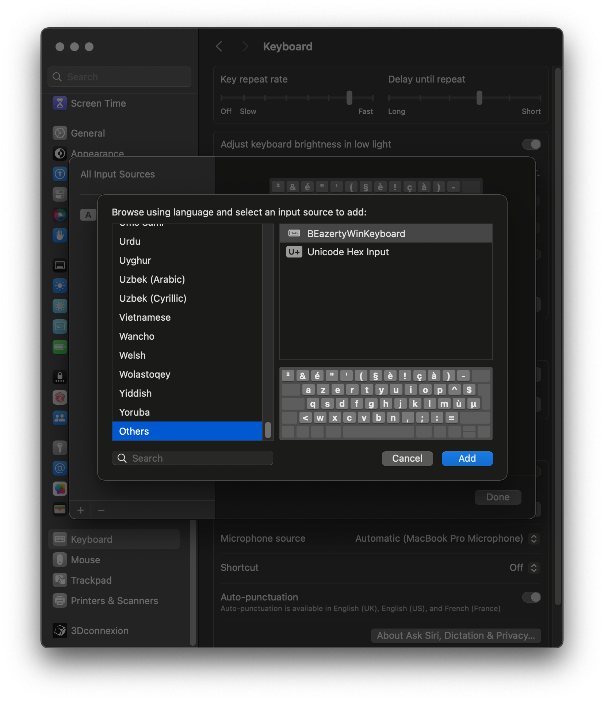
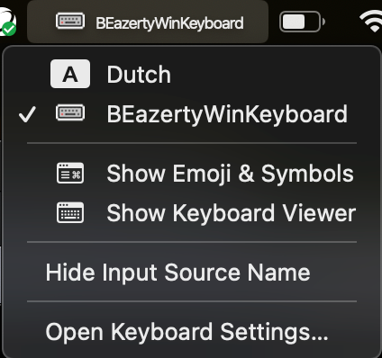

# Belgian azerty macbook keyboard layout file for external Windows keyboards
Mac .keylayout file with Belgian azerty layout.

I created this Mac keyboard layout for my own personal need to match the Belgian azerty labels on an external Windows usb keyboard (Corsair K70).
It will match most of the external Windows keyboards with Belgian azerty ISO layout though.

- Windows key acts as Command Key
- AltGr and Alt key acts as Option key
- **¨** and **^** keys are properly working in combination with other characters for instance **ë** and **ê**

## Example picture of usb-keyboard with BE-azerty layout

## How to use
1. Copy .keylayout file from Github to your Mac
   - copy corsairk70_azertyBE.keylayout file from Mac_keyboard_layouts folder to "/Library/Keyboard Layouts/" on your Mac
   - logout or reboot
   - login again
2. Select keyboard layout
   - open "Apple icon" on the top left-> "System settings" -> "Keyboard"
   - click "Input sources" -> "Edit"
   - click "+"
   - choose "Others" -> "BEazertyWinKeyboard"
   - click "Add"

- From now you can switch keyboard to "BEazertyWinKeyboard" from the right top bar.

## Tooling used
The keyboard layout is made with [Ukele](https://software.sil.org/ukelele/)
## Inspired by
https://github.com/roelandmoors/azerty
