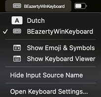

# Belgian-azerty macbook keyboard layout file for external Windows keyboards
Mac keylayout file for external Windows keyboard with Belgian azerty layout.\

I created it for my own personal need to have a proper Belgian azerty keyboard layout on a Macbook that match with the labels on a usb connected Corsair K70 mechanical keyboard with Belgian Windows azerty layout.

It will match most of the external Windows keyboards with Belgian azerty layout though.
- Windows key acts as Command Key
- AltGr key acts as Option key
## Screenshot

## How to use
1. Copy the keyboard layout file
   - copy corsairk70_azertyBE.keylayout file from Mac_keyboard_layouts folder to "/Library/Keyboard Layouts/" on your Mac
   - logout or reboot
   - login again
2. Select keyboard layout
   - open "Apple icon" on the top left-> "System settings" -> "Keyboard"
   - click "Input sources" -> "Edit"
   - click "+"
   - choose "Others" -> "BEazertyWinKeyboard"
   - click "Add"

- From now you can switch keyboard to "BEazertyWinKeyboard" from the right top bar.

## Made with this tool
The keyboard layout is made with [Ukele](https://software.sil.org/ukelele/)
## Inspired by
https://github.com/roelandmoors/azerty